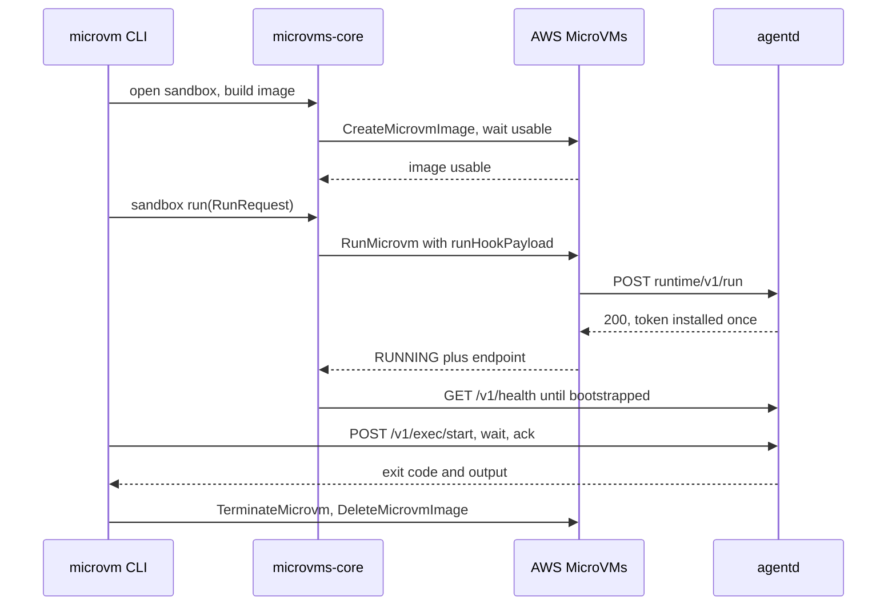
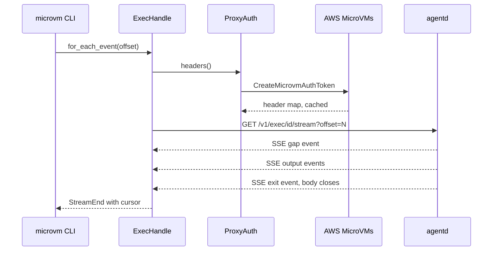
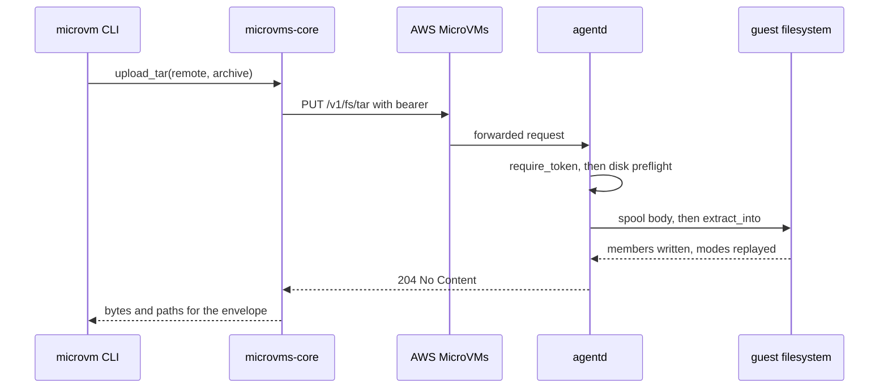

# microvms-agentd · Data flow

Two surfaces trigger work in this system and nothing else does: a CLI invocation, dispatched
through an exhaustive match (`crates/microvms-cli/src/main.rs:457-517`), and a daemon HTTP
request, dispatched through a handler table walked from the same list `/v1/schema` publishes
(`crates/agentd/src/routes.rs:110`). The bindings re-enter the same `microvms-core` surfaces the CLI
uses, so they add no distinct flow, and the daemon's only recurring job is a 30-second
expired-exec reaper rather than a request lifecycle (`crates/agentd/src/main.rs:67`,
`crates/agentd/src/exec.rs:975`).

The flows below are ranked by how much of the client-to-daemon boundary each exercises,
tie-broken by whether it is named after one of the system's core verbs. Flow 1 is the only arm
that launches a VM and the only one that touches the CLI, core, AWS, and the daemon. Flow 2 is
the streaming read path, whose correctness rests on a byte-offset cursor that survives a
reconnect through the endpoint proxy. Flow 3 is the file-transfer path, and it ends in the
daemon's one confined write.

Participants are the workspace crates named in `architecture/module-map.md` plus external
actors. `microvm CLI` is `microvms-cli`; `agentd` is the in-VM daemon; `AWS MicroVMs` is the
control plane together with its endpoint proxy.

## Flow 1: microvm run — build, launch, bootstrap, exec, tear down

1. `commands::lifecycle::run` resolves region, size class, and image name, then requires every
   infra role before anything is created, so a missing role surfaces immediately rather than
   after a build (`crates/microvms-cli/src/commands/lifecycle.rs:475`, guard at
   `crates/microvms-cli/src/commands/lifecycle.rs:609-663`).
2. It opens a `Sandbox` through the library seam and races `launch_and_exec` against ctrl-c in a
   `tokio::select!`, with the sandbox owned outside the select so a cancelled launch still holds
   the identifiers teardown needs (`crates/microvms-cli/src/commands/lifecycle.rs:670-716`,
   recovery at `crates/microvms-cli/src/commands/lifecycle.rs:731-742`).
3. `launch_and_exec` takes the image from `--image`, from `--artifact-uri`, or from a
   content-addressed build. `--image` launches an existing image and builds nothing.
   `--artifact-uri` builds from the caller's object with no upload: it preflights the build
   request, then `Sandbox::build_image` issues `CreateMicrovmImage` and waits for the image to
   become usable. Without either flag, `Sandbox::ensure_image` builds the image
   `<name>-<hash12>`, reuses it when it is already ready, and uploads the artifact only when a
   build is needed (`crates/microvms-cli/src/commands/lifecycle.rs:1064-1132`,
   `crates/microvms-app/src/sandbox.rs:917`, `crates/microvms-app/src/sandbox.rs:941`).
4. `Sandbox::run` refuses a second bootstrap on the same sandbox, mints the agent token, and
   wraps it with the launch env in a typed `RunHookPayload` that checks its 4096-byte budget
   before any call (`crates/microvms-app/src/sandbox.rs:1105`, refusal at
   `crates/microvms-app/src/sandbox.rs:1110`, payload at `crates/microvms-app/src/sandbox.rs:1169`).
5. `ControlPlane::run_microvm` validates the identifier, the duration range, and the role ARN,
   splits ingress and egress connectors by intent, and puts the payload on the wire
   (`crates/microvms-app/src/control/microvm.rs:433`, checks in `launch_connectors` at
   `crates/microvms-app/src/control/microvm.rs:477`).
6. The platform calls the daemon's run hook over loopback; `run_hook` unwraps the envelope,
   parses the inner payload, and installs the token once — an identical replay is 200 and a
   different token is 409 (`crates/agentd/src/routes.rs:180`, verdicts at
   `crates/agentd/src/routes.rs:236-272`).
7. `ControlPlane::wait_for_running` polls to RUNNING and fails fast on any terminal state; the
   client then polls unauthenticated `/v1/health` until `bootstrapped`
   (`crates/microvms-app/src/control/microvm.rs:609`, `crates/microvms-app/src/session/mod.rs:410`). The
   sandbox marks the token installed only after RUNNING is observed
   (`crates/microvms-app/src/sandbox.rs:1295-1297`).
8. The optional workload runs through `Session::run_sync` — start, wait, ack — and `tear_down`
   plus `attach_cost` then run however the select ended
   (`crates/microvms-app/src/session/mod.rs:476`, `crates/microvms-cli/src/commands/lifecycle.rs:1337`,
   `crates/microvms-cli/src/commands/lifecycle.rs:1391`).

## Flow 2: microvm exec --stream — SSE output on a byte-offset cursor

1. `commands::attached::exec` attaches a session from the identifier triple, builds the start
   request under a caller-supplied or minted `exec_id`, starts the command, then branches to
   `stream_exec` (`crates/microvms-cli/src/commands/attached.rs:243`, branch at
   `crates/microvms-cli/src/commands/attached.rs:334-343`).
2. `stream_exec` drives `ExecHandle::for_each_event` with a `FnMut(ExecEvent) -> ControlFlow<()>`
   callback, writes one NDJSON line plus the raw bytes per event, and reports `nextOffset` from
   core's cursor rather than its own tally (`crates/microvms-cli/src/commands/attached.rs:479`, cursor
   read at `crates/microvms-cli/src/commands/attached.rs:534`).
3. `for_each_event` delegates to `for_each_event_async`, whose loop steps the `advance` state
   machine, reads the cursor off the machine, and reports `EndReason::Cut` when a body ends with
   no `exit` event (`crates/microvms-app/src/session/exec.rs:483`, loop at
   `crates/microvms-app/src/session/exec.rs:555-564`).
4. `advance` re-attaches at the last good cursor with a fixed backoff on a retryable failure,
   and errors out past `max_reconnects` instead of looping forever
   (`crates/microvms-app/src/session/exec.rs:596`, backoff and re-attach at
   `crates/microvms-app/src/session/exec.rs:623-627`).
5. `ExecHandle::attach` issues `GET /v1/exec/{id}/stream?offset=N` with
   `accept: text/event-stream`, building its headers inside the request path so a mid-stream
   reconnect re-mints an expired token (`crates/microvms-app/src/session/exec.rs:727`, mint at
   `crates/microvms-app/src/session/exec.rs:736`).
6. `ProxyAuth::headers` serves the cached proxy token, or takes the mint lock and re-checks
   freshness under it so two racing tasks do not burn two control-plane calls
   (`crates/microvms-app/src/session/proxy.rs:412`, double check at
   `crates/microvms-app/src/session/proxy.rs:501-510`).
7. The daemon's `stream` handler snapshots the replay ring, reads the terminal marker after the
   snapshot, and sends the SSE body with a keepalive plus `x-accel-buffering: no` so a buffering
   proxy cannot batch a live stream into one delivery at exit (`crates/agentd/src/exec.rs:477`,
   ordering at `crates/agentd/src/exec.rs:496-501`, header at `crates/agentd/src/exec.rs:511-513`).
8. `build_stream` emits any `gap` first, drains the replayed backlog, then the live broadcast
   channel, and closes the body one step after the terminal `exit` event
   (`crates/agentd/src/exec.rs:584`, ending at `crates/agentd/src/exec.rs:628-639`).

## Flow 3: microvm cp --tar — an archive into the one confined write path

1. `commands::attached::cp` resolves the direction from the `vm:` prefix before opening
   anything, so two local paths or two remote paths are refused by name rather than guessed at
   (`crates/microvms-cli/src/commands/attached.rs:1473`, resolver at
   `crates/microvms-cli/src/commands/attached.rs:1589`).
2. It attaches through the helper every command in that file starts with, which resolves the
   region first because the region is what the proxy-token mint's ARN is derived for
   (`crates/microvms-cli/src/commands/attached.rs:95`).
3. The upload arm reads the local archive whole and sends it without inspecting it: the daemon's
   extractor is the only one in the system, and a client-side check would be a second set of
   member rules that could disagree with it
   (`crates/microvms-cli/src/commands/attached.rs:1494-1517`, stated at
   `crates/microvms-cli/src/commands/attached.rs:1466-1472`).
4. `Session::upload_tar` delegates to `files::upload_tar`, which builds
   `PUT /v1/fs/tar?path=...` with `content-type: application/x-tar` and the archive bytes as the
   body (`crates/microvms-app/src/session/mod.rs:538`, `crates/microvms-app/src/session/files.rs:133`).
5. `Transport::request` sends through `request_inner`, which prepends the proxy headers and the
   session's bearer token to the caller's own headers rather than replacing them, which is what
   keeps the content type on the request (`crates/microvms-app/src/session/mod.rs:139`, header assembly at
   `crates/microvms-app/src/session/mod.rs:111`).
6. `auth::require_token` guards the control router before the body is polled, answering 503
   when no token is installed and 401 on a mismatch, then draining a bounded prefix of the
   rejected body so the client sees the status rather than a TCP reset
   (`crates/agentd/src/auth.rs:62`, verdicts at `crates/agentd/src/auth.rs:69-83`, applied at
   `crates/agentd/src/routes.rs:66-69`).
7. `fs::write_tar` refuses a relative extraction root, preflights free disk against that root
   before the body is spooled, then spools the body under the disk pacer
   (`crates/agentd/src/fs.rs:1438`, preflight at `crates/agentd/src/fs.rs:1464-1466`, spool at
   `crates/agentd/src/fs.rs:898`).
8. `extract_into` runs under `spawn_blocking` and holds one confined directory handle for the
   whole extraction: ownership and xattrs are dropped, device and fifo members are refused,
   out-of-tree link targets are refused, and directory modes are replayed after all content
   lands. Success is 204 (`crates/agentd/src/fs.rs:647`, refusals at `crates/agentd/src/fs.rs:728-733` and
   `crates/agentd/src/fs.rs:768`, deferred modes at `crates/agentd/src/fs.rs:836`, dispatch and status at
   `crates/agentd/src/fs.rs:1484-1492`).

## See also

- [processes](../behavior/processes.md)
- [sequences](../diagrams/behavioral/sequences.md)
- [debugging guide](../insights/debugging-guide.md)
- [impact analysis](../insights/impact-analysis.md)
- [business logic](../insights/business-logic.md)
