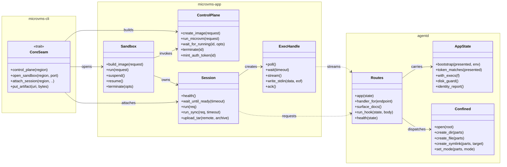

# microvms-agentd · Components

```mermaid
classDiagram
    direction LR

    namespace microvms-cli {
        class CoreSeam {
            <<trait>>
            +control_plane(region)
            +open_sandbox(region, port)
            +attach_session(region, ..)
            +put_artifact(uri, bytes)
        }
    }

    namespace microvms-app {
        class Sandbox {
            +build_image(request)
            +run(request)
            +suspend()
            +resume()
            +terminate(opts)
        }
        class ControlPlane {
            +create_image(request)
            +run_microvm(request)
            +wait_for_running(id, opts)
            +terminate(id)
            +mint_auth_token(id)
        }
        class Session {
            +health()
            +wait_until_ready(timeout)
            +run(req)
            +run_sync(req, timeout)
            +upload_tar(remote, archive)
        }
        class ExecHandle {
            +poll()
            +wait(timeout)
            +stream()
            +write_stdin(data, eof)
            +ack()
        }
    }

    namespace agentd {
        class Routes {
            +app(state)
            +handler_for(endpoint)
            +surface_docs()
            +run_hook(state, body)
            +health(state)
        }
        class AppState {
            +bootstrap(presented, env)
            +token_matches(presented)
            +with_execs(f)
            +disk_guard()
            +identity_report()
        }
        class Confined {
            +open(root)
            +create_dir(parts)
            +create_file(parts)
            +create_symlink(parts, target)
            +set_mode(parts, mode)
        }
    }

    CoreSeam --> ControlPlane : builds
    CoreSeam --> Sandbox : opens
    CoreSeam --> Session : attaches
    Sandbox --> ControlPlane : invokes
    Sandbox --> Session : owns
    Session --> ExecHandle : creates
    Session ..> Routes : requests
    ExecHandle ..> Routes : streams
    Routes --> AppState : carries
    Routes --> Confined : dispatches
```

## Legend

| Node or edge | Citations |
| --- | --- |
| `CoreSeam` | trait `microvms-cli/src/seam.rs:138`; methods `microvms-cli/src/seam.rs:140`, `:143`, `:150`, `:174`; `AwsSeam` impl `:181`, `:207`, `:225`, `:249` |
| `Sandbox` | struct `microvms-app/src/sandbox.rs:604`; methods `:886`, `:1028`, `:1447`, `:1531`, `:1635` |
| `ControlPlane` | struct `microvms-app/src/control/mod.rs:130`; methods `microvms-app/src/control/image.rs:157`, `microvms-app/src/control/microvm.rs:356`, `:435`, `:563`, `:583` |
| `Session` | struct `microvms-app/src/session/mod.rs:175`; methods `:271`, `:284`, `:322`, `:350`, `:386` |
| `ExecHandle` | struct `microvms-app/src/session/exec.rs:218`; methods `:233`, `:253`, `:290`, `:632`, `:662` |
| `Routes` | module of free functions, not a type: `agentd/src/routes.rs:36`, `:110`, `:371`, `:178`, `:314` |
| `AppState` | struct `agentd/src/state.rs:110`; methods `:202`, `:245`, `:257`, `:176`, `:183` |
| `Confined` | struct `agentd/src/fs.rs:297`; methods `:350`, `:416`, `:428`, `:448`, `:535` |
| `CoreSeam --> ControlPlane` | `microvms-cli/src/seam.rs:140`, impl `:181` |
| `CoreSeam --> Sandbox` | `microvms-cli/src/seam.rs:143`, impl `:207` |
| `CoreSeam --> Session` | `microvms-cli/src/seam.rs:150`, impl `:225` |
| `Sandbox --> ControlPlane` | `microvms-app/src/sandbox.rs:65-67`, `:888`, `:1116`, `:1466`, `:1554`, `:1658` |
| `Sandbox --> Session` | `microvms-app/src/sandbox.rs:69`, `:822`, `:1028` |
| `Session --> ExecHandle` | `microvms-app/src/session/mod.rs:322`, `:345` |
| `Session ..> Routes` | `microvms-app/src/session/mod.rs:273`, `:324`; `microvms-app/src/session/files.rs:45`, `:52` |
| `ExecHandle ..> Routes` | `microvms-app/src/session/exec.rs:238`, `:600`, `:667` |
| `Routes --> AppState` | `agentd/src/routes.rs:36` |
| `Routes --> Confined` | `agentd/src/routes.rs:132-135`, `agentd/src/fs.rs:1433`, `:1480`, `:631` |
| `..>` dashed | the HTTP wire, not a crate dependency: the shared contract is the `protocol` crate, re-exported at `microvms-core/src/lib.rs:100` and `agentd/src/routes.rs:18-20`, and the permitted directions are asserted by `microvms-cli/tests/dependency_direction.rs` |
| `+` prefix | the class-diagram marker for a listed member, not a Rust visibility claim: `Confined` and its methods are crate-private (`agentd/src/fs.rs:297`, `:350`), as are `routes::run_hook` and `routes::health` (`agentd/src/routes.rs:178`, `:314`) |

## See also

- [impact analysis](../../insights/impact-analysis.md)
- [processes](../../behavior/processes.md)
- [business logic](../../insights/business-logic.md)
- [sequences](../behavioral/sequences.md)
- [data flow](../../architecture/data-flow.md)
